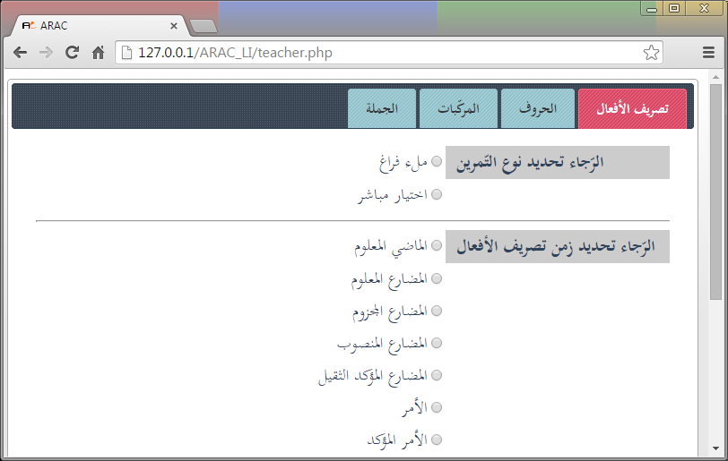
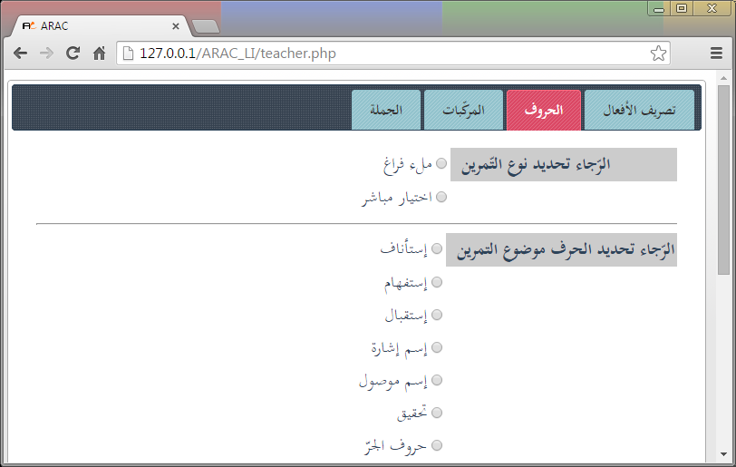
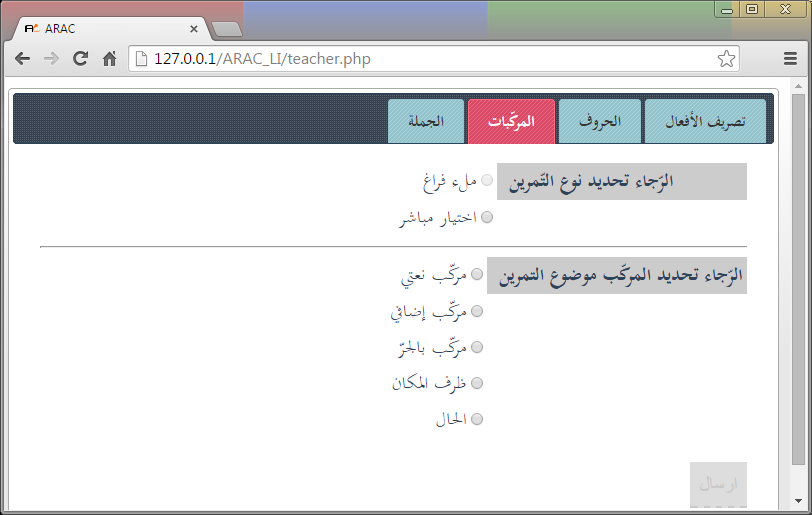
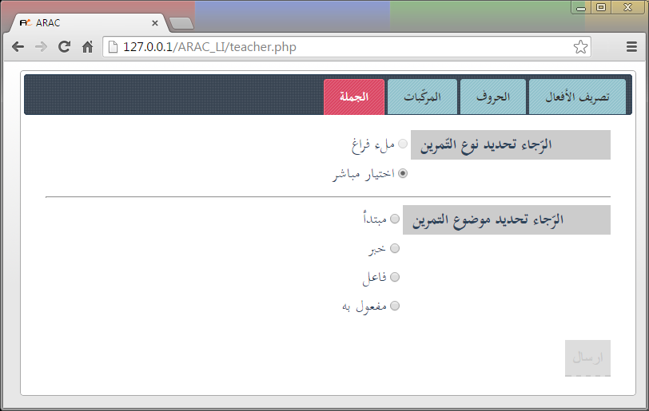
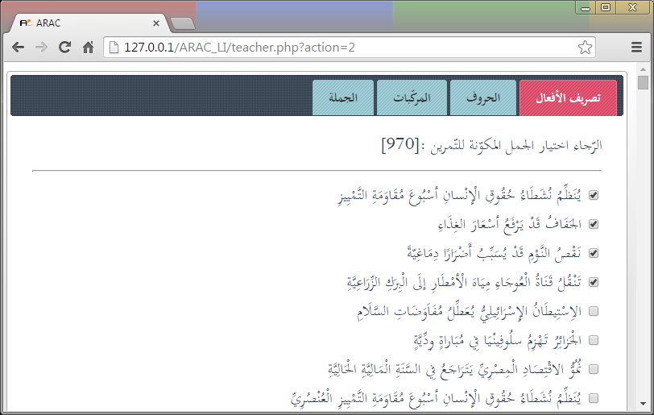
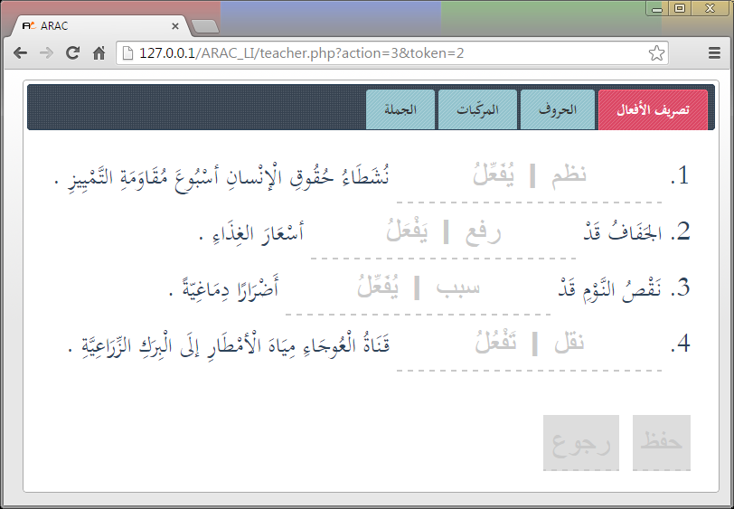
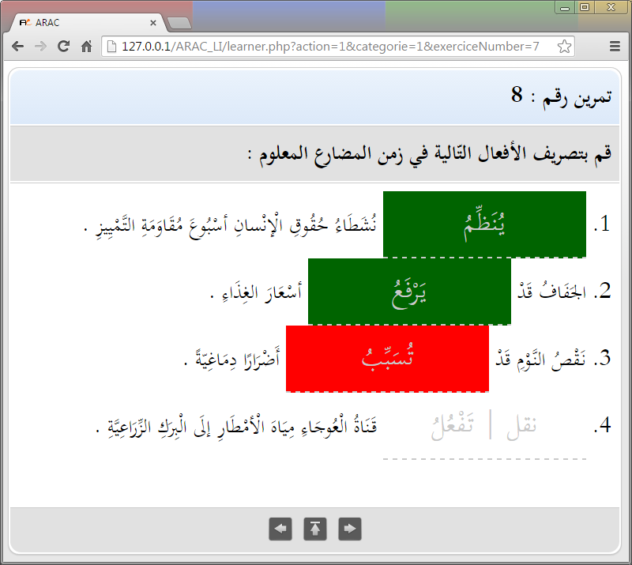
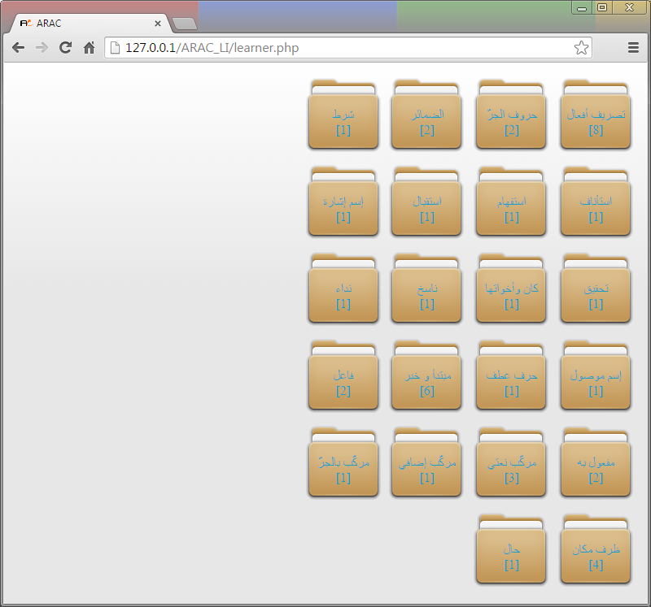

# ARAC L. I.
ARAC learning interface is an ASP based activities generator for Arabic learning.

###Screenshots
**Screenshots 1**

**Screenshots 2**

**Screenshots 3**

**Screenshots 4**

**Screenshots 5**

**Screenshots 6**

**Screenshots 7**

**Screenshots 8**

**Screenshots 9**

ARAC L. I. is free software; it's distributed in the hope that it will be useful.

Mohamed Achraf BEN MOHAMED     
mohamedachraf@gmail.com
